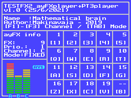

# PSG ayFX Player MSX SDCC Library (fR3eL Project)

```
Architecture: MSX
Format: C Object (SDCC .rel)
Programming language: C and Z80 assembler

Authors: 
        Original code: SapphiRe  <http://z80st.auic.es>
        This adaptation to SDCC: mvac7 
        
In examples/test_ROM software, PT3 songs:
- "Mathematical brain" by Makinavaja (for XI MICROCOMPO AY) 
```


---

## Description

Library for launch sound effects for the PSG AY-3-8910 or compatible.  

It is an adaptation of [ayFX REPLAYER](http://www.z80st.es/blog/tags/ayfx) Fixed Volume v1.31 made by SapphiRe.

The names of the functions have been changed to adapt it to the nomenclature of the sound libraries of the fR3eL project.

To function it requires the AY38910BF library. The function that dumps the registers buffer to the sound processor (PlayAY), 
has been moved to AY38910BF library because it is applicable to other music libraries (such as PT3player).
You also get the possibility of selecting to which sound processor the data processed by the players should be directed (internal or external AY).

Use them for developing MSX applications using Small Device C Compiler (SDCC).

This project is an Open Source library. 
You can add part or all of this code in your application development or include it in other libraries/engines.

You can access the documentation here with [`How to use the library`](docs/HOWTO.md).

In the source code [`examples/`](examples/), you can find applications for testing and learning purposes.



This library is part of the [`MSX fR3eL Project`](https://github.com/mvac7/SDCC_MSX_fR3eL).

Enjoy it!                           


<br/>

---

## Features

- Designed for developing MSX applications using Small Device C Compiler (SDCC).
- It does not use the BIOS so it can be used to program both ROMs or MSX-DOS executables.
- Up to 256 effects per bank. Multiple banks can be defined and changed from the initialization function.
- Priority parameter. The effects with the highest priority will be executed on the ones with the lowest.
- 2 modes of operation:
   1) Fixed. They will be heard on the indicated channel.
   2) Cyclical. The ayFX sample will be mixed on a different PSG channel in each frame.


<br/>

---

## History of versions

- v1.0 (7 July 2021) First SDCC version.


<br/>

---

## Requirements

### For compile:

- [Small Device C Compiler (SDCC) v4.1](http://sdcc.sourceforge.net/)
- [Hex2bin v2.5](http://hex2bin.sourceforge.net/)
- [PSG AY-3-8910 BF MSX SDCC Library](https://github.com/mvac7/SDCC_AY38910BF_Lib)


### For create a FXs bank
 
- [AY Sound FX Editor](https://shiru.untergrund.net/software.shtml) by Shiru
- [AY Sound FX Editor (Improved)](https://github.com/Threetwosevensixseven/ayfxedit-improved) by Shiru and Robin Verhagen-Guest

<br/>

---

## AY Sound System

The [`AY38910BF`](https://github.com/mvac7/SDCC_AY38910BF_Lib), [`PT3player`](https://github.com/mvac7/SDCC_AY38910BF_Lib) and [`ayFXplayer`](https://github.com/mvac7/SDCC_ayFXplayer) libraries are designed to work together, so you will have a system to provide music and effects in game development.


<br/>

---

## Acknowledgments
  
I want to give a special thanks to all those who freely share their knowledge with the MSX developer community.

- Sapphire/Z80ST > [`WEB`](http://z80st.auic.es/)
- Shiru > [`WEB`](https://shiru.untergrund.net/software.shtml)
- Makinavaja for his music. [`SoundCloud`](https://soundcloud.com/makimsx)
- Avelino Herrera > [`WEB`](http://msx.avelinoherrera.com)
- Nerlaska > [`Blog`](http://albertodehoyonebot.blogspot.com.es)
- Marq/Lieves!Tuore > [`Marq`](http://www.kameli.net/marq/) [`Lieves!Tuore`](http://www.kameli.net/lt/)
- MSXKun/Paxanga soft > [`WEB`](http://paxangasoft.retroinvaders.com/)
- Fubukimaru [`gitHub`](https://github.com/Fubukimaru)
- Andrear > [`Blog`](http://andrear.altervista.org/home/msxsoftware.php)
- Fernando García > [`Video Tutoriales`](http://www.z80st.es/cursos/bitvision-assembler)
- Ramones > [`MSXblog`](https://www.msxblog.es/tutoriales-de-programacion-en-ensamblador-ramones/) - [`MSXbanzai`](http://msxbanzai.tni.nl/dev/faq.html)
- Eric Boez > [`gitHub`](https://github.com/ericb59)
- MSX Assembly Page > [`WEB`](http://map.grauw.nl/resources/msxbios.php)
- Portar MSX Tech Doc > [`WEB`](https://problemkaputt.de/portar.htm)
- MSX Resource Center [`Development Wiki`](https://www.msx.org/wiki/#Developing_for_MSX)
- Karoshi MSX Community > [`WEB`](http://karoshi.auic.es/)
- BlueMSX emulator >> [`WEB`](http://www.bluemsx.com/)
- OpenMSX emulator >> [`WEB`](http://openmsx.sourceforge.net/)
- [`WebMSX`](https://webmsx.org/) emulator by Paulo A. Peccin >> [`gitHub`](https://github.com/ppeccin/webmsx)
- fMSX emulator by Marat Fayzullin [`WEB`](https://fms.komkon.org/fMSX/)
- Meisei emulator by Hap >> `?`